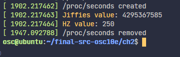
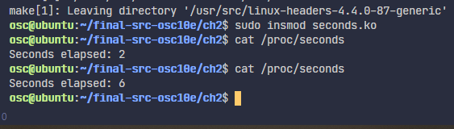

# jiffies-project
This assignment showcases kernel module creation and deletion, as well as a preview of how proc files are created within these modules.  

How to run: 
    1. change directory to hello/jiffies/seconds 
    2. Run "sudo insmod <filename.ko>" (e.g. "sudo insmod seconds.ko"), this will insert the module into the kernel 
    3. Run "cat /proc/<\filename>" to display the kernel module's functionality (e.g. "cat /proc/seconds") 
    4. Run "sudo rmmod <filename.ko>" to remove the module from the kernel (e.g. "sudo rmmod seconds.ko") 
    5. Run "dmesg" to verify that the kernel module was loaded and removed properly. 

Commands in action using seconds as an example: 

 
 
